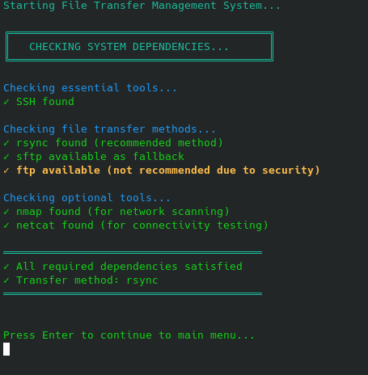

# File Transfer Management System

A comprehensive, menu-driven bash script for managing file transfers between Linux machines on a network. Features automatic device discovery, progress tracking, logging, and remote deployment capabilities.

---

<pre style="background:#222; color:#0f0; padding:12px; border-radius:6px;">
<span style="color:#4af; font-weight:bold;">Publisher:</span> 
Date 04/12/2025
Md Harrington
Bexleyheath Kent
London UK DA68NP

<span style="color:#4af; font-weight:bold;">Address</span>
1st Bed
17-19 Heathfeld Road
Bexleyheath 
Kent DA6 8NP

<span style="color:#f88;">Please see links for direct contact at end of this page .</span>

<div align="center">

</div>

## Table of Contents

- [Overview](#overview)
- [Features](#features)
- [Requirements](#requirements)
- [Installation](#installation)
- [Quick Start](#quick-start)
- [Menu Options Explained](#menu-options-explained)
- [Configuration Files](#configuration-files)
- [SSH Key Setup](#ssh-key-setup)
- [Code Architecture](#code-architecture)
- [Troubleshooting](#troubleshooting)
- [Advanced Usage](#advanced-usage)

---

## Overview

This script provides a user-friendly interface for transferring files and folders between Linux machines on the same network. It automates device discovery, tracks transfer history, and can deploy itself to remote machines for network-wide availability.

**Use Cases:**
- Setting up file synchronization across multiple machines
- Backing up files to remote servers
- Distributing files to multiple computers on a network
- Managing a home lab or small office network
- Automated deployment workflows

---

## Features

###  **Automatic Network Discovery**
- Scans entire subnet using `nmap -sn`
- Detects MAC addresses and identifies manufacturers
- Shows online/offline status for all devices
- Resolves hostnames automatically

###  **File Transfer**
- Bidirectional transfers (send/receive)
- Supports both files and directories
- Transfer only changed files (incremental sync)
- Real-time progress indicators
- Uses rsync for efficient transfers

###  **Comprehensive Logging**
- Logs all transfers with timestamps
- Records username, IP, hostname for both parties
- Maintains logs on both local and remote machines
- View transfer history anytime

###  **Remote Deployment**
- Deploy script to single remote host
- Deploy to all configured hosts at once
- Automatic configuration synchronization
- Makes script executable on remote

### **Dependency Management**
- Auto-detects required packages
- Offers to install missing dependencies
- Supports multiple package managers (apt, yum, dnf, pacman, zypper)
- Graceful fallbacks when tools unavailable

### **User Interface**
- Color-coded output for clarity
- Progress bars and spinners
- Table-formatted device listings
- Error handling with helpful messages

---

## Requirements

### Essential
- **Operating System:** Linux (any distribution)
- **Bash:** Version 4.0 or higher
- **SSH:** For remote connections
- **rsync:** For file transfers (script will offer to install)

### Optional (Recommended)
- **nmap:** For network scanning (required for auto-discovery)
- **netcat (nc):** For connectivity testing
- **sudo access:** For MAC address detection and package installation

---

## Installation

### 1. Download the Script

```bash
# Download to your home directory
cd ~
wget https://your-repo/transferfiles.sh
# OR if you have the file locally
# Just place it in your preferred location
```

### 2. Make It Executable

```bash
chmod +x transferfiles.sh
```

### 3. Run Initial Setup

```bash
./transferfiles.sh
```

The script will:
- Check for required dependencies
- Offer to install missing packages
- Create configuration files
- Guide you through initial setup

### 4. (Optional) Install System-Wide

```bash
sudo cp transferfiles.sh /usr/local/bin/filetransfer
sudo chmod +x /usr/local/bin/filetransfer
```

Now you can run it from anywhere with just: `filetransfer`

---

## Quick Start

### First Time Setup

1. **Run the script:**
   ```bash
   ./transferfiles.sh
   ```

2. **Let it check dependencies** - It will install or notify you of missing tools

3. **Choose Option 1** - Configure/Update Device List

4. **Select Auto-Discovery** - Scan your network for devices

5. **Add devices** - Choose to add all or select specific ones

6. **Start transferring!** - Use Options 5 or 6 for file transfers

### Basic File Transfer Example

**To send files to a remote machine:**

1. Choose **Option 5** (Transfer Files/Folders to Remote)
2. Select the remote device from the list
3. Enter the source path (e.g., `/home/user/documents`)
4. Enter the destination path on remote (e.g., `/home/user/backup`)
5. Choose transfer mode (all files or only changed)
6. Watch the progress and wait for completion

**To receive files from a remote machine:**

1. Choose **Option 6** (Receive Files/Folders from Remote)
2. Select the remote device
3. Enter the source path on remote
4. Enter the local destination path
5. Choose transfer mode
6. Files are downloaded with progress tracking

---

## Menu Options Explained

### Option 1: Configure/Update Device List

**Purpose:** Initial setup and configuration management

**What it does:**
- Creates configuration file if it doesn't exist
- Lets you choose between auto-discovery or manual entry
- Updates existing configuration with new devices

**When to use:**
- First time running the script
- Adding new devices to your network
- Updating device information

---

### Option 2: Show Local and Remote Devices

**Purpose:** View all configured devices and their status

**What it does:**
- Displays your local machine info (IP, hostname)
- Lists all remote devices with online/offline status
- Tests connectivity to each device in real-time

**When to use:**
- Before starting a transfer (to check device availability)
- To verify device configuration
- To see which devices are currently online

**Example Output:**
```
╔════════════════════════════════════════╗
║         LOCAL DEVICE INFO              ║
╚════════════════════════════════════════╝
  IP Address: 192.168.0.100
  Hostname:   mylaptop.local
  User:       john

╔════════════════════════════════════════╗
║        REMOTE DEVICES                  ║
╚════════════════════════════════════════╝
  [1] server1 - 192.168.0.50 [ONLINE]
  [2] nas - 192.168.0.60 [OFFLINE]
  [3] desktop - 192.168.0.70 [ONLINE]
```

---

### Option 3: Auto-Discover Network Devices

**Purpose:** Automatically find all devices on your network

**What it does:**
- Scans the entire subnet (192.168.x.0/24)
- Detects IP addresses, hostnames, and MAC addresses
- Identifies device manufacturers
- Shows which devices are already configured
- Lets you add new devices selectively or all at once

**Requirements:**
- `nmap` must be installed
- Run with `sudo` for MAC address detection

**When to use:**
- Setting up on a new network
- Finding new devices that joined the network
- Verifying all network devices

**Example Output:**
```
╔════════════════════════════════════════════════════════╗
║              DISCOVERED DEVICES                        ║
╚════════════════════════════════════════════════════════╝

ID   IP Address      Hostname          MAC Address         Manufacturer
---- --------------- ----------------- ------------------- --------------
1    192.168.0.1     router           18:0C:7A:3C:61:63   Unknown        [NEW]
2    192.168.0.50    server1          00:0F:B5:01:CB:77   Netgear        [NEW]
-    192.168.0.100   mylaptop         A4:83:E7:1B:2C:3D   Apple          [EXISTS]
3    192.168.0.200   pi-hole          B8:27:EB:7D:8E:9F   Raspberry Pi   [NEW]
```

---

### Option 4: Add Device Manually

**Purpose:** Add specific devices by entering their IP address

**What it does:**
- Prompts for IP address and validates format
- Tests connectivity to the device
- Attempts to resolve hostname automatically
- Checks for duplicates
- Allows adding multiple devices in sequence

**When to use:**
- Adding devices on different subnets
- Adding specific known devices without scanning
- When nmap is not available
- Adding devices that don't respond to network scans

**Example Workflow:**
```
Enter remote device IP: 192.168.0.50
Testing connectivity to 192.168.0.50...
✓ Host is reachable
✓ Found hostname: fileserver
Use this hostname? (y/n): y
✓ Successfully added device:
  IP:       192.168.0.50
  Hostname: fileserver
Add another device? (y/n): n
```

---

### Option 5: Transfer Files/Folders to Remote

**Purpose:** Send files or directories from local machine to remote

**What it does:**
1. Shows list of remote devices
2. Tests connectivity to selected device
3. Validates source path exists locally
4. Prompts for destination path on remote
5. Offers choice between "all files" or "changed only"
6. Transfers files with progress display
7. Logs transfer on both machines (if SSH keys configured)

**Transfer Methods:**
- Uses `rsync` (preferred) - efficient, resumes on failure
- Falls back to `sftp` if rsync unavailable

**Options:**
- **All files:** Transfers everything, overwrites existing
- **Changed only:** Only transfers modified files (faster)

**Example:**
```
Remote Host: server1 (192.168.0.50)
✓ Connection OK

Source path: /home/user/documents
Destination path: /backup/documents
Transfer mode:
  1. All files
  2. Only changed files
Choice: 2

╔════════════════════════════════════════╗
║        TRANSFER IN PROGRESS...         ║
╚════════════════════════════════════════╝
From:   /home/user/documents
To:     user@192.168.0.50:/backup/documents
Mode:   changed
Method: rsync

[====>          ] 42% (215.4MB/512.8MB) 8.3MB/s

✓ Transfer completed successfully
✓ Remote log updated
```

---

### Option 6: Receive Files/Folders from Remote

**Purpose:** Download files or directories from remote machine to local

**What it does:**
- Same as Option 5 but in reverse direction
- Pulls files from remote to local machine
- Creates local destination directory if needed
- All same features (progress, logging, etc.)

**When to use:**
- Backing up files from remote server
- Downloading shared files
- Retrieving work from another machine
- Syncing directories from remote to local

---

### Option 7: View Transfer History

**Purpose:** Review all past file transfers

**What it does:**
- Shows last 20 transfer log entries
- Color-coded by operation type (SEND/RECEIVE)
- Displays full log file location
- Offers to view complete log with `less`

**Log Entry Format:**
```
[2026-01-07 21:45:32] SEND|mylaptop|192.168.0.100|john|server1|192.168.0.50|/home/user/docs|/backup/docs|rsync
[2026-01-07 21:50:15] RECEIVE|mylaptop|192.168.0.100|john|nas|192.168.0.60|/media/photos|/home/user/photos|rsync
```

**Log Fields:**
1. Timestamp
2. Operation (SEND/RECEIVE/DEPLOY)
3. Local hostname
4. Local IP
5. Username
6. Remote hostname
7. Remote IP
8. Source path
9. Destination path
10. Transfer method

---

### Option 8: Test System Dependencies

**Purpose:** Check and install required software

**What it does:**
- Checks for SSH, rsync, sftp, ftp
- Detects optional tools (nmap, netcat)
- Shows which transfer methods are available
- Offers to install missing packages
- Detects package manager automatically

**Supported Package Managers:**
- apt (Debian/Ubuntu)
- yum (RHEL/CentOS 7)
- dnf (Fedora/RHEL 8+)
- pacman (Arch Linux)
- zypper (openSUSE)

**When to use:**
- After installation to verify setup
- When transfers aren't working
- Before deploying to remote machines
- Troubleshooting issues

---

### Option 9: Deploy Script to Remote Host

**Purpose:** Install this script on a single remote machine

**What it does:**
1. Lets you select remote host
2. Choose deployment location:
   - `/usr/local/bin/` (system-wide, needs sudo)
   - `~/bin/` (user directory)
   - `~/` (home directory)
   - Custom path
3. Transfers the script via SCP
4. Makes it executable (`chmod +x`)
5. Syncs configuration file
6. Verifies installation
7. Optionally tests execution

**Example:**
```
Target Host: server1 (192.168.0.50)
Script: transferfiles.sh

Choose deployment location:
  1. /usr/local/bin/transferfiles.sh (system-wide)
  2. ~/bin/transferfiles.sh (user directory)
  3. ~/transferfiles.sh (home directory)
  4. Custom path
Choice: 2

[1/5] Creating remote directory...
✓ Directory ready
[2/5] Transferring script...
✓ Script transferred
[3/5] Making script executable...
✓ Script is now executable
[4/5] Syncing configuration...
✓ Configuration synced
[5/5] Verifying installation...
✓ Verification successful

╔════════════════════════════════════════╗
║   DEPLOYMENT COMPLETED SUCCESSFULLY    ║
╚════════════════════════════════════════╝

Remote host can now run the script:
  ~/bin/transferfiles.sh
```

---

### Option 10: Deploy Script to All Remote Hosts

**Purpose:** Batch deployment to all configured devices

**What it does:**
- Counts all remote hosts in configuration
- Tests connectivity before deploying
- Deploys to each host sequentially
- Shows progress for each host
- Syncs configuration to all hosts
- Provides summary (successful/failed)

**When to use:**
- Setting up a new network
- Updating script on all machines
- Distributing configuration changes
- Creating a mesh network of transfer-enabled machines

**Example:**
```
Found 5 remote host(s)
Deploy to all? (y/n): y

Choose deployment location for all hosts:
  1. ~/bin/transferfiles.sh (recommended)
  2. ~/transferfiles.sh
Choice: 1

[1/5] Deploying to server1 (192.168.0.50)...
  ✓ Deployment successful
  ✓ Configuration synced

[2/5] Deploying to nas (192.168.0.60)...
  ✗ Host unreachable, skipping

[3/5] Deploying to desktop (192.168.0.70)...
  ✓ Deployment successful
  ✓ Configuration synced

════════════════════════════════════════
Successful: 4
Failed: 1
════════════════════════════════════════
```

---

### Option 11: Exit

**Purpose:** Cleanly exit the script

**What it does:**
- Logs script shutdown
- Shows goodbye message
- Returns to shell

---

## Configuration Files

### Device Configuration: `~/.file_transfer_devices.ini`

**Purpose:** Stores all configured devices

**Format:**
```ini
# File Transfer Devices Configuration
# Format: TYPE|IP|HOSTNAME

LOCAL|192.168.0.100|mylaptop.local
REMOTE|192.168.0.50|server1
REMOTE|192.168.0.60|nas-server
REMOTE|192.168.0.70|desktop-pc
```

**Fields:**
- `TYPE`: LOCAL or REMOTE
- `IP`: IPv4 address
- `HOSTNAME`: Device hostname or friendly name

**Location:** User's home directory
**Permissions:** Read/write by user only

---

### Transfer Log: `~/.file_transfer.log`

**Purpose:** Records all file transfer operations

**Format:**
```
[YYYY-MM-DD HH:MM:SS] OPERATION|LOCAL_HOST|LOCAL_IP|USER|REMOTE_HOST|REMOTE_IP|SOURCE|DEST|METHOD
```

**Example Entries:**
```
[2026-01-07 21:30:15] SEND|mylaptop|192.168.0.100|john|server1|192.168.0.50|/home/john/docs|/backup/docs|rsync
[2026-01-07 21:35:42] RECEIVE|mylaptop|192.168.0.100|john|nas|192.168.0.60|/media/photos|/home/john/photos|rsync
[2026-01-07 21:40:03] DEPLOY|mylaptop|192.168.0.100|john|desktop|192.168.0.70|/home/john/transferfiles.sh|~/bin/transferfiles.sh
[2026-01-07 21:41:28] AUTO-DISCOVERED|pi-server|192.168.0.200|B8:27:EB:XX:XX:XX|Raspberry Pi Foundation
```

**Location:** Both local and remote machines (if SSH keys configured)
**Retention:** No automatic cleanup, grows indefinitely

---

## SSH Key Setup

### Why SSH Keys?

SSH keys enable:
- **Passwordless authentication** - No manual password entry
- **Remote logging** - Script can log on remote machines
- **Automated workflows** - No user interaction required
- **Better security** - More secure than passwords

### Setup Instructions

#### 1. Generate SSH Key (if you don't have one)

```bash
ssh-keygen -t rsa -b 4096
```

**Prompts:**
```
Enter file in which to save the key (/home/user/.ssh/id_rsa): [Press Enter]
Enter passphrase (empty for no passphrase): [Press Enter for no password]
Enter same passphrase again: [Press Enter]
```

**Result:** Creates `~/.ssh/id_rsa` (private) and `~/.ssh/id_rsa.pub` (public)

#### 2. Copy Key to Remote Host

```bash
ssh-copy-id username@remote_ip
```

**Example:**
```bash
ssh-copy-id john@192.168.0.50
```

**First time:** You'll be asked for the remote password
**After:** No password needed for that host

#### 3. Test Connection

```bash
ssh username@remote_ip "echo 'Success!'"
```

If it prints "Success!" without asking for password, you're set!

#### 4. Repeat for All Hosts

Do steps 2-3 for each remote machine you want to transfer files with.

### Quick Setup for Multiple Hosts

```bash
# Create a list of hosts
HOSTS="192.168.0.50 192.168.0.60 192.168.0.70"

# Copy key to all
for host in $HOSTS; do
    ssh-copy-id user@$host
done
```

### Troubleshooting SSH Keys

**Problem:** Still asking for password

**Solutions:**
```bash
# Check if key exists
ls -la ~/.ssh/id_rsa*

# Check SSH config
cat ~/.ssh/config

# Test with verbose output
ssh -v user@remote_ip

# Check remote permissions
ssh user@remote_ip "chmod 700 ~/.ssh && chmod 600 ~/.ssh/authorized_keys"
```

---

## Code Architecture

### Overview

The script is organized into functional modules, each handling a specific aspect of the system.

### Main Components

#### 1. **Configuration & Constants**
```bash
INI_FILE="$HOME/.file_transfer_devices.ini"
LOG_FILE="$HOME/.file_transfer.log"
REMOTE_LOG_PATH="$HOME/.file_transfer.log"
```

**Purpose:** Define global paths and settings
**Location:** Top of script (lines 1-20)

---

#### 2. **Color Definitions**
```bash
RED='\033[0;31m'
GREEN='\033[0;32m'
YELLOW='\033[1;33m'
BLUE='\033[0;34m'
CYAN='\033[0;36m'
NC='\033[0m'  # No Color
```

**Purpose:** Terminal color codes for UI
**Usage:** `echo -e "${GREEN}Success!${NC}"`

---

#### 3. **Utility Functions**

##### `detect_package_manager()`
- Detects Linux distribution's package manager
- Returns: apt, yum, dnf, pacman, zypper, or unknown
- Used for automatic package installation

##### `install_package()`
- Installs packages using detected package manager
- Handles sudo requirements
- Returns success/failure

##### `log_message()`
- Writes to local log file
- Format: `[TIMESTAMP] MESSAGE`
- Creates log file if doesn't exist

##### `get_local_ip()`
- Gets machine's primary IP address
- Falls back to multiple methods if first fails
- Returns: IPv4 address string

##### `get_hostname()`
- Gets machine's hostname
- Returns: hostname string or "unknown"

##### `validate_ip()`
- Validates IPv4 address format
- Uses regex: `^[0-9]{1,3}\.[0-9]{1,3}\.[0-9]{1,3}\.[0-9]{1,3}$`
- Returns: 0 (valid) or 1 (invalid)

##### `validate_path()`
- Validates file/directory paths
- Optionally checks existence
- Returns: 0 (valid) or 1 (invalid)

##### `show_spinner()`
- Animated spinner for long operations
- Characters: `-\|/`
- Runs while background process active

##### `show_progress_bar()`
- Visual progress bar
- Format: `[=====>     ] 50% (127/254)`
- Updates in place using `\r`

---

#### 4. **Network Functions**

##### `test_connectivity()`
```bash
test_connectivity() {
    local host="$1"
    local show_progress="$2"
    
    # Try ping first
    if ping -c 1 -W "$timeout" "$host" &>/dev/null; then
        return 0
    fi
    
    # Try nc if available
    if command -v nc &> /dev/null; then
        if nc -z -w "$timeout" "$host" 22 &>/dev/null; then
            return 0
        fi
    fi
    
    return 1
}
```

**Purpose:** Test if remote host is reachable
**Methods:** 
1. ICMP ping (primary)
2. Netcat to port 22 (fallback)
**Returns:** 0 if reachable, 1 if not

##### `get_manufacturer()`
```bash
get_manufacturer() {
    local mac="$1"
    local oui=$(echo "$mac" | tr '[:lower:]' '[:upper:]' | sed 's/[:-]//g' | cut -c1-6)
    
    case "$oui" in
        B827EB|DCA632|E45F01|DC2395)
            echo "Raspberry Pi Foundation" ;;
        000569|000C29|005056)
            echo "VMware" ;;
        # ... 70+ manufacturers ...
        *)
            echo "Unknown" ;;
    esac
}
```

**Purpose:** Identify device manufacturer from MAC address
**Method:** OUI (Organizationally Unique Identifier) lookup
**Database:** 70+ common manufacturers hardcoded
**Fallback:** Uses nmap's vendor if OUI unknown

##### `scan_network()`
**Purpose:** Discover all devices on subnet
**Process:**
1. Detects local IP and calculates subnet
2. Checks if nmap is available
3. Prompts for sudo (for MAC detection)
4. Runs `nmap -sn SUBNET`
5. Parses output with regex
6. Calls `get_manufacturer()` for each MAC
7. Returns formatted device list

**Output Format:** `IP|HOSTNAME|MAC|MANUFACTURER`

**Regex Patterns:**
```bash
# Match: Nmap scan report for hostname (ip)
[[ "$line" =~ Nmap\ scan\ report\ for\ ([^\ ]+)\ \(([0-9.]+)\) ]]

# Match: MAC Address: XX:XX:XX:XX:XX:XX (Vendor)
[[ "$line" =~ MAC\ Address:\ ([0-9A-Fa-f:]{17})\ \((.+)\) ]]
```

---

#### 5. **Device Management Functions**

##### `update_ini_file()`
**Purpose:** Create or update device configuration
**Modes:**
- `create`: Initialize new INI file
- `update`: Add devices to existing file

**Flow:**
1. Create INI file with header
2. Add local device (automatic)
3. Prompt: Auto-discover or Manual?
4. Save devices to INI file

##### `add_device_manually()`
**Purpose:** Add single device by IP
**Steps:**
1. Prompt for IP address
2. Validate IP format
3. Check for duplicates
4. Test connectivity
5. Try to resolve hostname
6. Save to INI file

**Features:**
- Hostname auto-resolution
- Duplicate detection
- Connectivity verification
- Multi-device entry in loop

##### `auto_discover_devices()`
**Purpose:** Scan network and add devices
**Process:**
1. Call `scan_network()`
2. Parse results into table
3. Compare with existing devices
4. Mark as [NEW] or [EXISTS]
5. Prompt: Add all / Add selected / Skip
6. Save selections to INI

**Table Format:**
```
ID   IP Address      Hostname          MAC Address         Manufacturer
---- --------------- ----------------- ------------------- --------------
1    192.168.0.50    server1           00:0F:B5:01:CB:77   Netgear
```

##### `display_devices()`
**Purpose:** Show all configured devices
**Output:**
- Local device info (IP, hostname, user)
- Remote devices with online/offline status
- Numbered list for easy selection

**Real-time Status:**
- Calls `test_connectivity()` for each device
- Shows `[ONLINE]` or `[OFFLINE]`

##### `select_remote_host()`
**Purpose:** Let user choose remote device
**Methods:**
- By number from list
- By IP address directly
**Validation:**
- Checks if selection exists
- Tests connectivity
- Warns if unreachable
**Sets Global Variables:**
- `REMOTE_IP`
- `REMOTE_HOST`

---

#### 6. **Transfer Functions**

##### `transfer_rsync()`
```bash
transfer_rsync() {
    local direction="$1"   # "send" or "receive"
    local source="$2"
    local destination="$3"
    local user="$4"
    local remote_ip="$5"
    local mode="$6"        # "all" or "changed"
    
    local rsync_opts="-avz --progress -h"
    
    if [ "$mode" == "changed" ]; then
        rsync_opts="$rsync_opts --update"
    fi
    
    rsync_opts="$rsync_opts --partial --timeout=30"
    
    if [ "$direction" == "send" ]; then
        rsync $rsync_opts "$source" "$user@$remote_ip:$destination"
    else
        rsync $rsync_opts "$user@$remote_ip:$source" "$destination"
    fi
}
```

**rsync Options Explained:**
- `-a`: Archive mode (preserves permissions, timestamps)
- `-v`: Verbose output
- `-z`: Compress during transfer
- `--progress`: Show file-by-file progress
- `-h`: Human-readable sizes
- `--update`: Skip files newer on receiver
- `--partial`: Keep partially transferred files
- `--timeout=30`: 30 second timeout

**Features:**
- Bidirectional support
- Incremental mode (only changed files)
- Resume capability (--partial)
- Real-time progress display
- Compressed transfer

##### `transfer_sftp()`
**Purpose:** Fallback transfer method if rsync unavailable
**Limitations:**
- Less efficient than rsync
- No partial transfer support
- Less detailed progress
**Process:**
- Uses batch mode SFTP
- `put -r` for upload
- `get -r` for download

##### `transfer_to_remote()`
**Purpose:** High-level send function
**Flow:**
1. Select remote host
2. Validate source path (must exist)
3. Get destination path
4. Choose transfer mode
5. Call appropriate transfer function
6. Log transaction locally
7. Attempt remote logging via SSH

**Error Handling:**
- Path validation
- Connectivity check
- Transfer verification
- Graceful failure messages

##### `receive_from_remote()`
**Purpose:** High-level receive function
**Similar to:** `transfer_to_remote()` but reversed
**Additional Feature:**
- Creates local destination if needed
- Prompts before creating directories

---

#### 7. **Deployment Functions**

##### `deploy_script_to_remote()`
**Purpose:** Install script on single remote host
**5-Step Process:**

**Step 1:** Create remote directory
```bash
ssh "$user@$REMOTE_IP" "mkdir -p $(dirname $remote_path)"
```

**Step 2:** Transfer script
```bash
scp "$script_path" "$user@$REMOTE_IP:$remote_path"
```

**Step 3:** Make executable
```bash
ssh "$user@$REMOTE_IP" "chmod +x $remote_path"
```

**Step 4:** Sync configuration
```bash
scp "$INI_FILE" "$user@$REMOTE_IP:$INI_FILE"
```

**Step 5:** Verify installation
```bash
ssh "$user@$REMOTE_IP" "test -x $remote_path"
```

**Features:**
- Multiple location options
- Configuration sync
- Verification step
- Optional test execution
- Full logging

##### `deploy_to_all_hosts()`
**Purpose:** Batch deployment to all configured hosts
**Process:**
1. Count remote hosts in INI
2. Prompt for deployment location
3. Loop through each host:
   - Test connectivity
   - Deploy if reachable
   - Skip if unreachable
   - Show progress
4. Display summary

**Summary:**
```
Successful: 4
Failed: 1
```

---

#### 8. **Dependency Management**

##### `check_dependencies()`
**Purpose:** Comprehensive system check
**Checks:**

**Essential Tools:**
- SSH (openssh-client)
- Transfer methods (rsync, sftp, ftp)

**Optional Tools:**
- nmap (for network scanning)
- netcat (for connectivity testing)

**Output Levels:**
- ✓ Found (green)
- ✗ Not found - will offer install (red)
- ○ Optional - not found (yellow)

**Auto-Install:**
- Detects package manager
- Prompts for each missing package
- Installs if user confirms

**Sets Global:**
- `TRANSFER_METHOD`: rsync, sftp, or ftp

---

#### 9. **History & Logging**

##### `view_history()`
**Purpose:** Display transfer history
**Features:**
- Shows last 20 entries
- Color-coded by operation
  - SEND: Cyan
  - RECEIVE: Blue
- Option to view full log with `less`
- Displays log file location

**Log Analysis:**
Users can grep the log for specific patterns:
```bash
# All transfers to specific host
grep "server1" ~/.file_transfer.log

# All transfers on a specific date
grep "2026-01-07" ~/.file_transfer.log

# All failed transfers (if you add error logging)
grep "FAILED" ~/.file_transfer.log

# Count transfers per host
cut -d'|' -f5 ~/.file_transfer.log | sort | uniq -c
```

---

#### 10. **Main Program Flow**

##### `show_menu()`
**Purpose:** Display main menu
**Features:**
- Color-coded options
- Shows current transfer method
- Clear numbering
- Consistent formatting

##### `main()`
**Purpose:** Primary program loop
**Flow:**
1. Run dependency check
2. Verify transfer method available
3. Create INI file if needed
4. Enter menu loop:
   - Display menu
   - Get user choice
   - Execute corresponding function
   - Wait for user before returning to menu
5. Handle exit gracefully

**Loop Structure:**
```bash
while true; do
    show_menu
    read -r choice
    
    case $choice in
        1) update_ini_file "update" ;;
        2) display_devices ;;
        3) auto_discover_devices ;;
        # ... etc ...
        11) exit 0 ;;
        *) echo "Invalid choice" ;;
    esac
    
    read -p "Press Enter to continue..."
done
```

**Error Trapping:**
```bash
trap 'echo "\nScript interrupted"; exit 130' INT TERM
```
- Catches Ctrl+C
- Cleans up gracefully
- Logs shutdown

---

## Troubleshooting

### Common Issues and Solutions

#### Issue: "nmap: command not found"

**Symptom:** Auto-discovery doesn't work

**Solution:**
```bash
# Ubuntu/Debian
sudo apt-get install nmap

# RHEL/CentOS/Fedora
sudo yum install nmap  # or dnf install nmap

# Arch
sudo pacman -S nmap
```

**Alternative:** Use Option 4 (Add Device Manually) instead

---

#### Issue: "Could not update remote log"

**Symptom:** Transfers work but remote logging fails

**Cause:** SSH keys not configured

**Solution:**
```bash
# Generate key if needed
ssh-keygen -t rsa -b 4096

# Copy to remote
ssh-copy-id user@remote_ip

# Test
ssh user@remote_ip "echo 'Works!'"
```

**Note:** Script will still work, just won't log on remote

---

#### Issue: Transfer hangs or times out

**Possible Causes:**
1. Firewall blocking rsync/SSH
2. Network connectivity issues
3. Wrong username or IP
4. SSH daemon not running on remote

**Debug Steps:**
```bash
# Test basic connectivity
ping remote_ip

# Test SSH
ssh user@remote_ip

# Check if rsync is installed on remote
ssh user@remote_ip "which rsync"

# Test rsync manually
rsync -avz /test/file user@remote_ip:/tmp/
```

**Firewall Solution:**
```bash
# On remote machine, allow SSH
sudo ufw allow 22/tcp
# or
sudo firewall-cmd --add-service=ssh --permanent
sudo firewall-cmd --reload
```

---

#### Issue: "Permission denied" during transfer

**Cause:** Insufficient permissions on remote path

**Solution:**
```bash
# Create destination directory first
ssh user@remote_ip "mkdir -p /path/to/destination"

# Set permissions
ssh user@remote_ip "chmod 755 /path/to/destination"
```

**Best Practice:** Transfer to directories in your home folder

---

#### Issue: MAC addresses show as "N/A"

**Cause:** Running without sudo

**Solution:**
```bash
# Run script with sudo
sudo ./transferfiles.sh

# Or run just the discovery with sudo
# The script will prompt when needed
```

**Why:** MAC address detection requires raw socket access (root)

---

#### Issue: Script shows wrong local IP

**Cause:** Multiple network interfaces

**Solution:** Edit the `get_local_ip()` function to use specific interface:
```bash
get_local_ip() {
    # Replace eth0 with your interface name
    ip addr show eth0 | grep "inet " | awk '{print $2}' | cut -d'/' -f1
}
```

**Find your interface:**
```bash
ip addr show
# or
ifconfig
```

---

#### Issue: Devices showing as offline but are actually online

**Causes:**
1. Firewall blocking ICMP ping
2. Device configured not to respond to ping

**Solution:** The script will still try to connect even if ping fails. Choose "Continue anyway" when prompted.

**Alternative Test:**
```bash
# Test port 22 directly
nc -zv remote_ip 22
```

---

#### Issue: "rsync: command not found" on remote

**Symptom:** Transfer fails with rsync error

**Solution:** Install rsync on remote machine:
```bash
# SSH to remote
ssh user@remote_ip

# Install rsync
sudo apt-get install rsync  # Debian/Ubuntu
sudo yum install rsync      # RHEL/CentOS
```

**Workaround:** Script will automatically fall back to SFTP

---

## Advanced Usage

### Automated Backups

Create a cron job for scheduled backups:

```bash
# Edit crontab
crontab -e

# Add daily backup at 2 AM
0 2 * * * /home/user/transferfiles.sh << EOF
5
1
/home/user/documents
/backup/documents
2
EOF
```

**Explanation:**
- `5`: Choose Option 5 (Transfer to remote)
- `1`: Select device #1
- Path inputs
- `2`: Transfer mode (changed only)

### Scripted Transfers

Create wrapper scripts for common tasks:

```bash
#!/bin/bash
# backup-docs.sh

/home/user/transferfiles.sh << ANSWERS
5
1
/home/user/documents
/backup/documents
2
ANSWERS
```

Make executable and run:
```bash
chmod +x backup-docs.sh
./backup-docs.sh
```

### Network-Wide Deployment

Deploy to all machines and sync configs:

```bash
# 1. Add all devices via auto-discovery
# 2. Deploy to all (Option 10)
# 3. Now all machines have the script and same config
# 4. Any machine can transfer to any other machine
```

**Result:** Complete mesh network for file transfers

### Integration with Other Scripts

Use the log file for monitoring:

```bash
#!/bin/bash
# check-transfers.sh

LOG="$HOME/.file_transfer.log"
LAST_HOUR=$(date -d '1 hour ago' '+%Y-%m-%d %H')

# Get transfers in last hour
COUNT=$(grep "$LAST_HOUR" "$LOG" | wc -l)

echo "Transfers in last hour: $COUNT"

# Alert if no transfers (expecting scheduled backup)
if [ $COUNT -eq 0 ]; then
    echo "WARNING: No transfers detected!"
    # Send email, notification, etc.
fi
```

### Custom Transfer Aliases

Add to `~/.bashrc`:

```bash
alias backup-docs='cd /home/user && ./transferfiles.sh << EOF
5
1
/home/user/documents
/backup/documents
2
EOF'

alias sync-photos='cd /home/user && ./transferfiles.sh << EOF
6
2
/media/photos
/home/user/photos
2
EOF'
```

Reload: `source ~/.bashrc`

Usage: Just type `backup-docs` or `sync-photos`

### Remote Execution

Deploy and run on remote:

```bash
# Deploy script
./transferfiles.sh  # Option 9

# Run on remote
ssh user@remote_ip "~/bin/transferfiles.sh << EOF
2
EOF"
```

### Logging Analysis

Parse logs for insights:

```bash
# Most transferred paths
cut -d'|' -f7 ~/.file_transfer.log | sort | uniq -c | sort -rn

# Transfers per day
cut -d' ' -f1 ~/.file_transfer.log | cut -d'[' -f2 | sort | uniq -c

# Average transfers per host
cut -d'|' -f5 ~/.file_transfer.log | sort | uniq -c

# Find large transfers (if you add size logging)
grep "SEND" ~/.file_transfer.log | grep "GB"
```

### Network Monitoring

Combine with other tools:

```bash
# Watch network in real-time while transferring
watch -n 1 'ifstat -i eth0 1 1'

# Monitor rsync processes
watch -n 1 'ps aux | grep rsync'

# Check bandwidth usage
iftop -i eth0
```

---

## Performance Tips

### 1. Use SSH Connection Multiplexing

Add to `~/.ssh/config`:
```
Host *
    ControlMaster auto
    ControlPath ~/.ssh/sockets/%r@%h-%p
    ControlPersist 600
```

Create socket directory:
```bash
mkdir -p ~/.ssh/sockets
```

**Benefit:** Reuses SSH connections, much faster for multiple operations

### 2. Increase rsync Performance

For large transfers, modify rsync options in script:
```bash
rsync_opts="-avz --progress -h --compress-level=1"
```

**Compress levels:**
- 0: No compression (fast, more bandwidth)
- 1-3: Light compression (good balance)
- 6: Default compression
- 9: Maximum compression (slow, less bandwidth)

### 3. Parallel Transfers

For multiple files, consider parallel rsync:
```bash
# Instead of single rsync, use parallel
ls -1 /source/*.tar | parallel rsync -avz {} user@remote:/dest/
```

**Note:** Requires `parallel` package

### 4. Local Network Optimization

On gigabit networks, disable compression:
```bash
rsync_opts="-av --progress -h --no-compress"
```

**Reason:** CPU overhead of compression > network savings on fast LANs

---

## Security Considerations

### 1. SSH Key Protection

**Protect private keys:**
```bash
chmod 600 ~/.ssh/id_rsa
chmod 644 ~/.ssh/id_rsa.pub
chmod 700 ~/.ssh
```

**Use passphrases** for keys in sensitive environments

### 2. Restrict SSH Access

On remote machines, restrict SSH to specific users:

Edit `/etc/ssh/sshd_config`:
```
AllowUsers user1 user2
```

Restart SSH:
```bash
sudo systemctl restart sshd
```

### 3. Firewall Configuration

Only allow SSH from known IPs:
```bash
# UFW
sudo ufw allow from 192.168.0.0/24 to any port 22

# firewalld
sudo firewall-cmd --add-rich-rule='rule family="ipv4" source address="192.168.0.0/24" port port="22" protocol="tcp" accept'
```

### 4. Log File Permissions

Logs contain transfer info - protect them:
```bash
chmod 600 ~/.file_transfer.log
chmod 600 ~/.file_transfer_devices.ini
```

### 5. Disable Password Authentication

After setting up keys, disable password SSH:

Edit `/etc/ssh/sshd_config`:
```
PasswordAuthentication no
```

**Warning:** Ensure keys work first!

---

## FAQ

### Q: Can I use this on macOS?

**A:** Mostly yes, but requires modification:
- Install GNU coreutils: `brew install coreutils`
- Some commands differ (e.g., `greadlink` vs `readlink`)
- Package manager detection won't work
- Use Homebrew for package installation

### Q: Does this work over the internet?

**A:** Yes, if:
- Remote machine has public IP or port forwarding
- SSH is accessible from internet
- Consider VPN for security
- Update firewall rules accordingly

**Example:**
```bash
# Add device with public IP
192.168.0.50 -> 203.0.113.50:2222
```

### Q: Can I transfer to Windows machines?

**A:** Not directly. Windows doesn't run bash scripts natively. Options:
- Install WSL (Windows Subsystem for Linux) on Windows
- Use rsync server on Windows (like cwRsync)
- Use Cygwin on Windows
- Alternative: Use WinSCP or similar for Windows endpoints

### Q: How do I uninstall?

**A:** Remove files:
```bash
rm ~/transferfiles.sh
rm ~/.file_transfer_devices.ini
rm ~/.file_transfer.log
```

If installed system-wide:
```bash
sudo rm /usr/local/bin/transferfiles
```

### Q: Can I run this as root?

**A:** Yes, but not recommended:
- Creates files in root's home
- Security risk
- Use sudo only when needed (e.g., package installation, nmap with MAC detection)

### Q: What about large files (> 100GB)?

**A:** Works fine! rsync handles any size:
- Use `--partial` (included) for resume capability
- Consider `--bwlimit` for bandwidth control
- Monitor with `--progress`

Example manual command:
```bash
rsync -avz --progress --partial --bwlimit=10000 /huge/file user@remote:/dest/
```

### Q: Can I exclude certain files?

**A:** Yes, modify rsync command to add exclusions:
```bash
rsync_opts="-avz --progress --exclude '*.tmp' --exclude 'cache/*'"
```

Or use exclude file:
```bash
rsync_opts="-avz --progress --exclude-from=/path/to/exclude-list.txt"
```

### Q: Does this support delta transfers?

**A:** Yes! rsync uses delta transfer algorithm:
- Only transfers changed portions of files
- Extremely efficient for large files with small changes
- Automatic with rsync

### Q: Can I schedule automatic transfers?

**A:** Yes, use cron (see Advanced Usage section)

### Q: What's the maximum file size?

**A:** Limited only by:
- Filesystem (ext4: 16TB, NTFS: 16TB, etc.)
- Network timeout (adjust `--timeout` in rsync)
- Disk space on destination

### Q: Can multiple users share the configuration?

**A:** Each user has their own config in `~/.file_transfer_devices.ini`

To share:
```bash
# Copy to shared location
sudo cp ~/.file_transfer_devices.ini /etc/file_transfer_devices.ini

# Modify script to use shared config
INI_FILE="/etc/file_transfer_devices.ini"
```

---

## Contributing

### Reporting Issues

Found a bug? Please include:
1. Linux distribution and version
2. Bash version: `bash --version`
3. Error message (exact text)
4. Steps to reproduce
5. Expected vs actual behavior

### Suggesting Features

Ideas welcome! Consider:
- Use case / scenario
- How it would work (UI mockup)
- Any implementation thoughts

### Code Contributions

Pull requests accepted for:
- Bug fixes
- Performance improvements
- Additional manufacturer OUI codes
- Better error handling
- Documentation improvements

**Coding Standards:**
- Follow existing style
- Add comments for complex sections
- Test on multiple distributions
- Update README if needed

---

## License

This script is provided as-is for personal and commercial use. Feel free to modify, distribute, and adapt to your needs.

**No warranty:** Use at your own risk. Always test transfers with non-critical data first.

---

## Credits

**Author:** Created based on user requirements for a comprehensive Linux file transfer solution

**Tools Used:**
- rsync - Fast incremental file transfer
- nmap - Network exploration tool
- OpenSSH - Secure shell
- Bash - GNU Bourne-Again SHell

**Inspiration:**
- Unix philosophy: "Do one thing and do it well"
- Modern DevOps practices
- Home lab management needs

---

## Version History

### Version 2.0 (Current)
- Auto-discovery with nmap
- Manufacturer detection (70+ vendors)
- Remote deployment capabilities
- Enhanced error handling
- SSH key management
- Comprehensive logging
- Progress indicators
- Batch operations

### Version 1.0 (Initial)
- Basic file transfer
- Manual device entry
- Simple logging
- Menu-driven interface

---

## Support

**Documentation:** This README
**Script Comments:** Inline documentation in code
**Examples:** See Advanced Usage section
**Community:** Share improvements and tips

---

## Appendix

### A. Complete Command Reference

**Package Installation:**
```bash
sudo apt-get install nmap rsync openssh-client  # Debian/Ubuntu
sudo yum install nmap rsync openssh-clients     # RHEL/CentOS
sudo dnf install nmap rsync openssh-clients     # Fedora
sudo pacman -S nmap rsync openssh               # Arch
```

**SSH Key Commands:**
```bash
ssh-keygen -t rsa -b 4096                    # Generate key
ssh-copy-id user@host                        # Copy to remote
ssh user@host "command"                      # Remote execution
ssh -o BatchMode=yes user@host              # No password prompt
```

**rsync Commands:**
```bash
rsync -avz source/ dest/                     # Basic sync
rsync -avz --delete source/ dest/            # Delete extras
rsync -avz --update source/ dest/            # Only newer files
rsync -avz --progress source/ dest/          # Show progress
rsync -avz --dry-run source/ dest/           # Test run
```

**Network Commands:**
```bash
nmap -sn 192.168.0.0/24                      # Ping scan
nmap -sS 192.168.0.1                         # Port scan
ping -c 4 192.168.0.1                        # Test connectivity
nc -zv 192.168.0.1 22                        # Test port
```

---

### B. Configuration Examples

**Multi-host INI:**
```ini
# Home network
LOCAL|192.168.0.100|laptop
REMOTE|192.168.0.50|fileserver
REMOTE|192.168.0.60|nas
REMOTE|192.168.0.70|desktop

# Work network (different subnet)
REMOTE|10.0.1.50|work-server
REMOTE|10.0.1.100|work-desktop
```

**SSH Config for Fast Connections:**
```
# ~/.ssh/config
Host 192.168.0.*
    User john
    ControlMaster auto
    ControlPath ~/.ssh/sockets/%r@%h-%p
    ControlPersist 600
    ServerAliveInterval 60
    ServerAliveCountMax 3
```

---

### C. Error Codes

| Code | Meaning | Solution |
|------|---------|----------|
| 1 | General error | Check error message |
| 2 | Syntax error | Check bash version |
| 127 | Command not found | Install missing package |
| 130 | Script interrupted (Ctrl+C) | Normal |
| 255 | SSH connection failed | Check network/SSH |

**rsync Exit Codes:**
| Code | Meaning |
|------|---------|
| 0 | Success |
| 1 | Syntax error |
| 3 | File selection errors |
| 10 | Error in socket I/O |
| 12 | Error in rsync protocol |
| 23 | Partial transfer |
| 255 | Error in SSH |

---

### D. Glossary

**Terms Used in This Document:**

- **Artifact:** The script file itself
- **Batch Mode:** Non-interactive SSH (no password prompts)
- **Delta Transfer:** Only transferring changed portions of files
- **INI File:** Configuration file for device list
- **MAC Address:** Hardware address of network interface
- **Mesh Network:** All devices can communicate with all other devices
- **OUI:** Organizationally Unique Identifier (first 6 hex digits of MAC)
- **Subnet:** Range of IP addresses on local network
- **SSH Keys:** Public/private key pair for authentication

---

**End of Documentation**

For updates and improvements, check the script comments and version history.

## Aditional links to this subject inclusive me personal links 

-   [FaceBook](https://www.facebook.com/mark.harrington.14289)
-   [Instagram](https://www.instagram.com/markukh2021/)
-   [Utube Channel](www.youtube.com/@markharrington5826)
-   [Threads](https://www.threads.com/@markukh2021)
-   [X formerly Twitter](https://x.com/MarkHar11467143)
-   [Personal Webpage](https://eliteprojects.x10host.com) 
